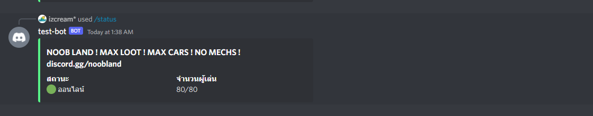

# NORMAN a discord bot for BattleMetric game server

## Requirement

- NodeJS 16+
- Server/VPS

## Installation

1. clone this repository
2. copy `.env` file from `.env.example`
3. edit .env fill you server data
4. run `npm install && npm run build`
5. run `npm start` to start bot server
6. ENJOI🤠

### .env variables detail

|PARAMETER|DESCRIPTION|
|---|---|
|BOT_ID| Discord Bot ID(application ID)|
|BOT_TOKEN|Discord BOT Token|
|SERVER_ID|BattleMetrics Server Id|
|COMMAND|The command for trigger bot|
|COMMAND_DESC| Description of command|
